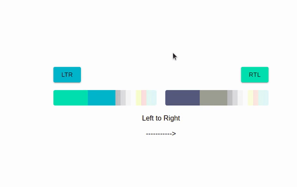

This project was implemented with [Create React App](https://github.com/facebook/create-react-app) and is a boilerplate for start a developing with [ReactJS](https://reactjs.org/), [Material UI](https://mui.com/) and [TypeScript](https://www.typescriptlang.org/)

### Features

-  Support [Material UI theming system](https://mui.com/customization/theming/);
- Support RTL plugin;
- Changing the theme;

##### palettes designed by [Hamidreza Khosravi](https://github.com/hrkhosravi)

## Development

Install all dependencies, in repo's root:

### `$ yarn`

In the project directory, you can run:

### `$ yarn start`

Runs the app in the development mode.

Open http://localhost:3000 to view it in the browser.

#### Start developing and enjoy it
